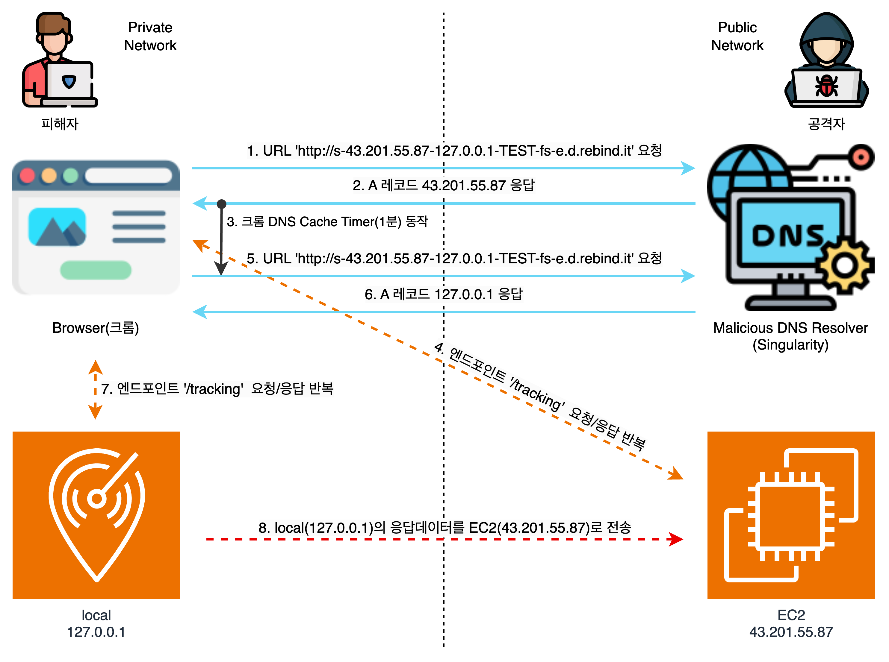
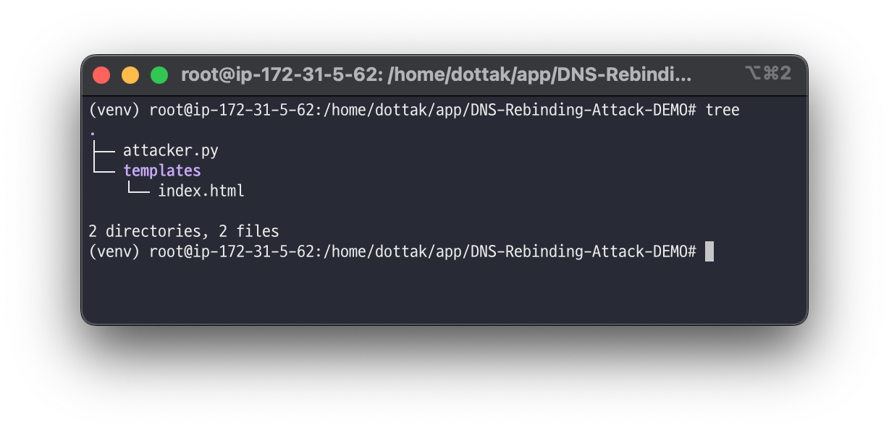
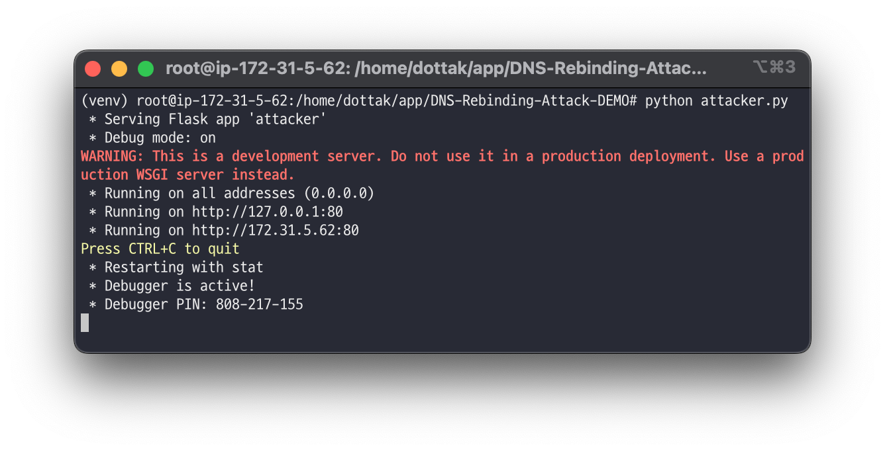
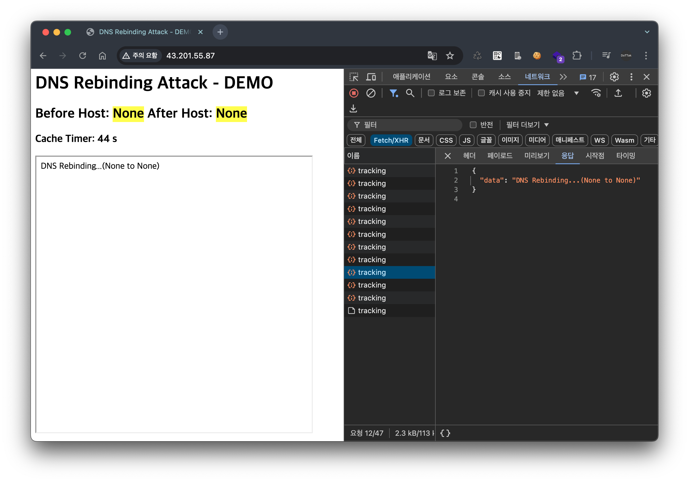
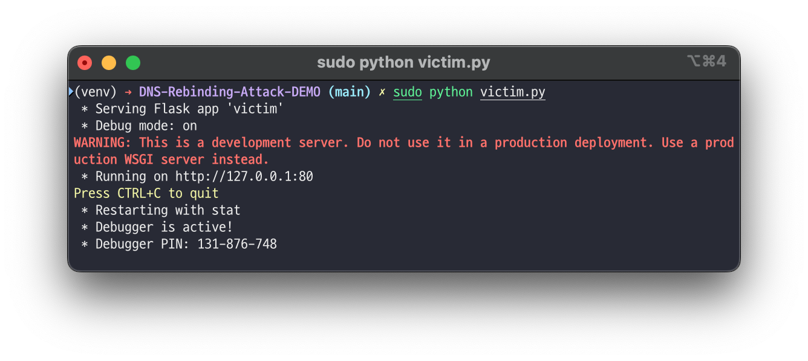
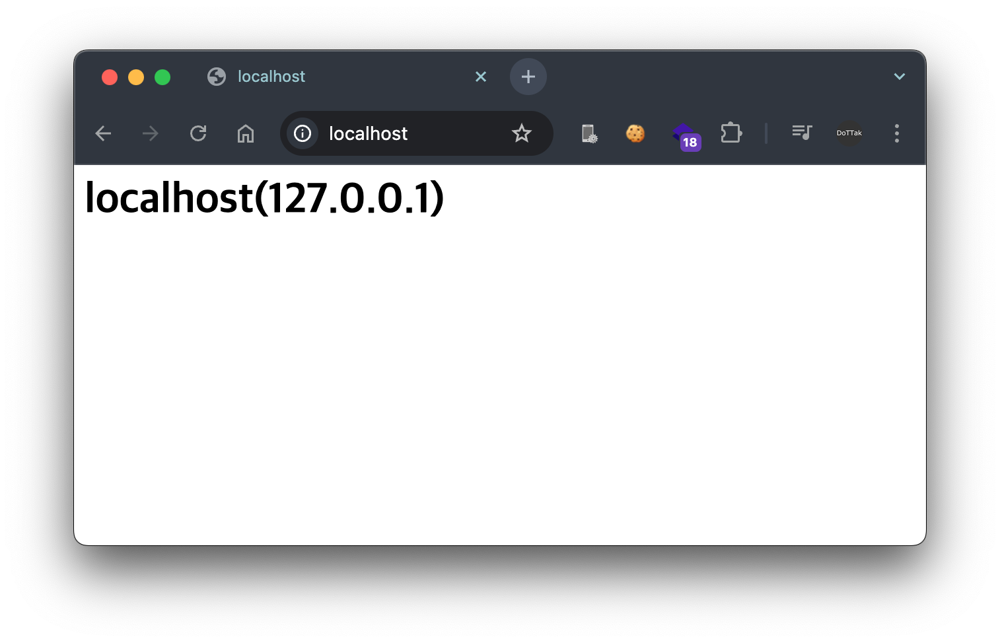
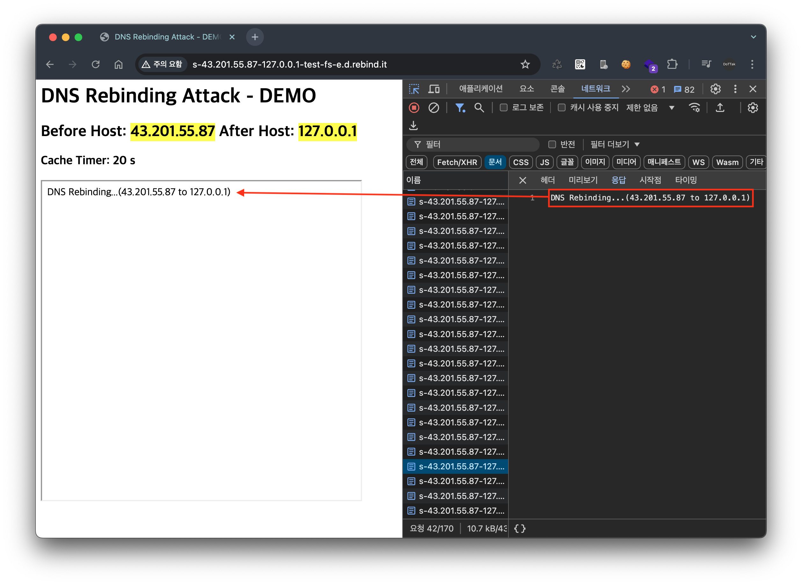
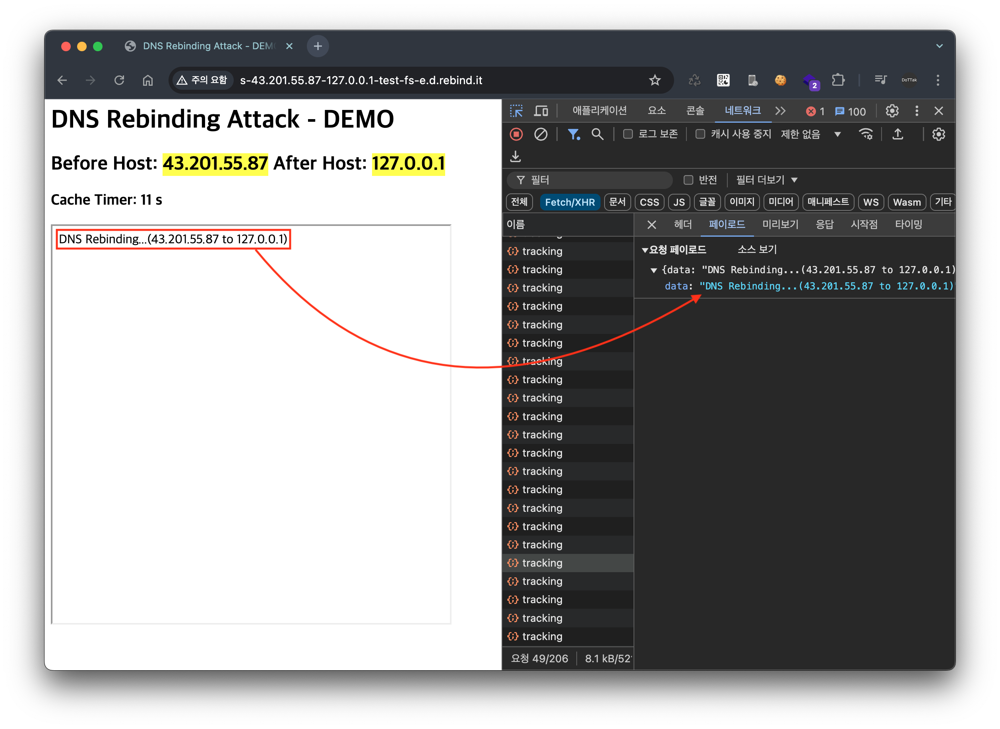
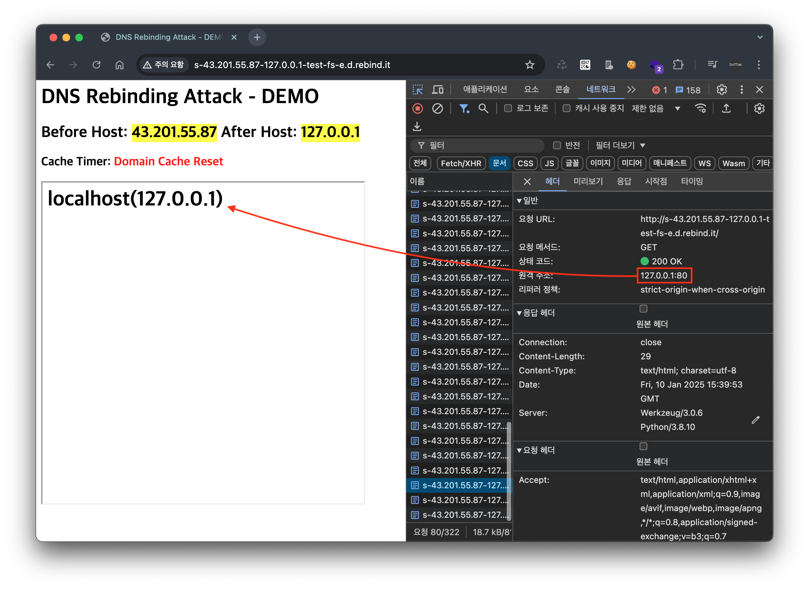
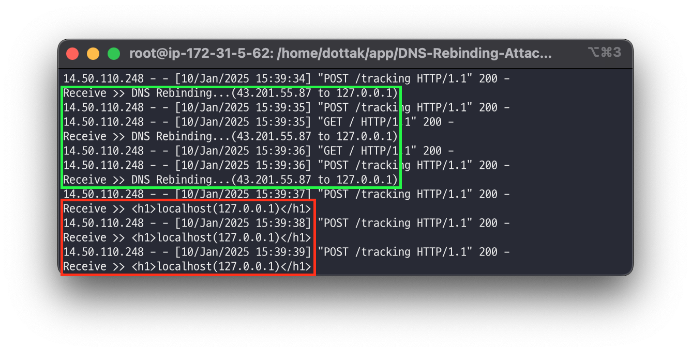

# DNS-Rebinding-Attack-DEMO

`DNS Rebinding` 공격을 실습하기 위한 전체 구조는 다음과 같습니다.



1. 피해자는 크롬 브라우저를 통해 URL `http://s-43.201.55.87-127.0.0.1-TEST-fs-e.d.rebind.it`에 접속합니다.
2. `fs` 옵션에 따라, `Session ID`가 `test`인 첫 번째 DNS 질의에 대해 A 레코드 응답으로 `43.201.55.87`을 받습니다.
3. 크롬 브라우저는 도메인 `s-43.201.55.87-127.0.0.1-TEST-fs-e.d.rebind.it`의 호스트 주소 `43.201.55.87`를 캐시에 저장합니다.
    
    > DNS 서버의 부하를 줄이고 응답 시간을 단축하기 위해 DNS 질의 결과를 일정 시간(기본값: 1분) 동안 저장합니다.
    > 
    > 
    > ref. https://kb.mozillazine.org/Network.dnsCacheExpiration
    > 
4. 이후 피해자의 브라우저는 `43.201.55.87` 서버 즉, 공격자의 웹 서버로 요청/응답을 반복적으로 수행합니다.
5. DNS 캐시가 만료되면 도메인 `s-43.201.55.87-127.0.0.1-TEST-fs-e.d.rebind.it`에 대한 DNS 질의를 다시 수행합니다.
6. 이때 두 번째 DNS 질의에 대해서는 A 레코드 응답으로 `127.0.0.1`을 받게 됩니다.
7. 크롬 브라우저는 도메인 `s-43.201.55.87-127.0.0.1-TEST-fs-e.d.rebind.it`의 호스트 주소를 `127.0.0.1`로 업데이트합니다. JavaScript는 계속해서 동일한 도메인(`s-43.201.55.87-127.0.0.1-TEST-fs-e.d.rebind.it`)으로 요청을 보내지만, 이제는 실제로 내부 서버(`127.0.0.1`)로 요청이 전달되어 피해자의 내부망에 있는 서버에 접근하게 됩니다.
8. 이후 피해자의 내부 서버(`127.0.0.1`)로부터 받은 응답 데이터가 공격자 서버(`43.201.55.87`)로 전송됩니다.

## Setup

```
.
├── README.md
├── attacker.py # 공격자 웹 서버
├── templates   # 공격자 웹 서버
│   └── index.html
└── victim.py # 피해자 웹 서버
```

### 공격자 웹 서버(43.201.55.87)

공격자 웹 서버는 인터넷 망(Public Network)에서 접근 가능한 웹 서버입니다. 현재 경로에서 Flask 앱 `attacker.py` 와 `templates` 폴더를 아래와 같이 이동시킵니다.



이후 `attacker.py` 를 실행합니다.(명령어: `python attacker.py`)



공격자 웹 서버(`43.201.55.87`)에 접속하면 다음과 같은 페이지가 나타납니다. 이 페이지는 현재 접속한 도메인을 `iframe`을 통해 반복적으로 렌더링하며, 그 결과를 공격자 웹 서버의 `/tracking` 엔드포인트로 전송합니다.



### 피해자 웹 서버(127.0.0.1)

피해자 웹 서버는 내부망(Private Network)에서만 접근 가능한 웹 서버입니다. 현재 경로에서 Flask 앱 `victim.py` 를 가져와 로컬 환경에서 실행합니다.(명령어: `python victim.py`)



피해자의 로컬 웹 서버는 다음과 같은 페이지를 반환합니다.



## Executing the DNS Rebinding Attack

공격자 웹 서버와 피해자 웹 서버 준비가 완료 됐으면, `http://s-<공격자 웹 서버>-127.0.0.1-TEST-fs-e.d.rebind.it/` 구조의 URL로 접속합니다.

여기서는 공격자 웹 서버의 IP 주소가 `43.201.55.87`이므로, 다음과 같은 URL로 접속합니다.

```
http://s-43.201.55.87-127.0.0.1-TEST-fs-e.d.rebind.it/
```

처음 요청한 도메인 `s-43.201.55.87-127.0.0.1-TEST-fs-e.d.rebind.it`의 DNS 질의 결과가 `43.201.55.87`이므로, DNS 캐시가 만료되기 전까지는 공격자의 웹 서버 응답이 `iframe` 태그에 렌더링됩니다.



또한, `iframe` 태그에서 렌더링된 결과가 공격자 웹 서버의 `/tracking` 엔드포인트로 지속적으로 전송됩니다.



이후 DNS 캐시가 만료되면, 동일한 도메인에 대한 두 번째 DNS 질의 결과로 `127.0.0.1` 을 받게 됩니다. 이로 인해 iframe 태그는 이제 피해자의 로컬 웹 서버 응답을 렌더링하고 있습니다.



결과적으로 공격자의 웹 서버 로그를 살펴보면, 초기에는 공격자 자신의 응답 데이터만 기록되다가 DNS 캐시가 만료된 이후에는 피해자의 내부망 서버 데이터가 노출되는 것을 확인할 수 있습니다. 이를 통해 DNS Rebinding 공격이 성공적으로 수행되어 브라우저의 동일 출처 정책(SOP)을 우회하고 내부망의 리소스에 접근했음이 확인됩니다.

